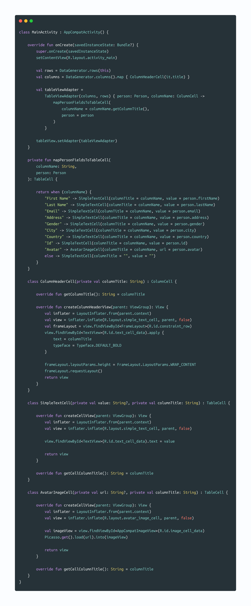

[  ](https://bintray.com/farhad/maven/tableview/_latestVersion)

```groovy
repositories {
	jcenter()
}
	
implementation 'io.github.aimsio:tableview:[latest-version]'
```
---

This library provides `TableViewLayout` and `TableViewAdapter` to help create a 2D table representation of any data on Android, enabling consumer classes to use
different custom cell layouts of their own logic and desire.

#### The benefits of our TableViewLayout

1. fluent and easy to understand api.

2. lightweight library size without any third party dependency.

3. maximum flexibility in enabling the consumer to use different logic and views for each column.


#### The integration process

1. create a list of Strings, representing your column titles.

2. create a list of your model objects. These are the objects you want to show in a tabular format.

3. provide a mapping function that defines the view and the logic of data display in each column, using your model object.



### License

    Copyright (C) 2020  Farhad Faghihi

    This program is free software: you can redistribute it and/or modify
    it under the terms of the GNU General Public License as published by
    the Free Software Foundation, either version 3 of the License, or
    (at your option) any later version.

    This program is distributed in the hope that it will be useful,
    but WITHOUT ANY WARRANTY; without even the implied warranty of
    MERCHANTABILITY or FITNESS FOR A PARTICULAR PURPOSE.  See the
    GNU General Public License for more details.

    You should have received a copy of the GNU General Public License
    along with this program.  If not, see <http://www.gnu.org/licenses/>.
